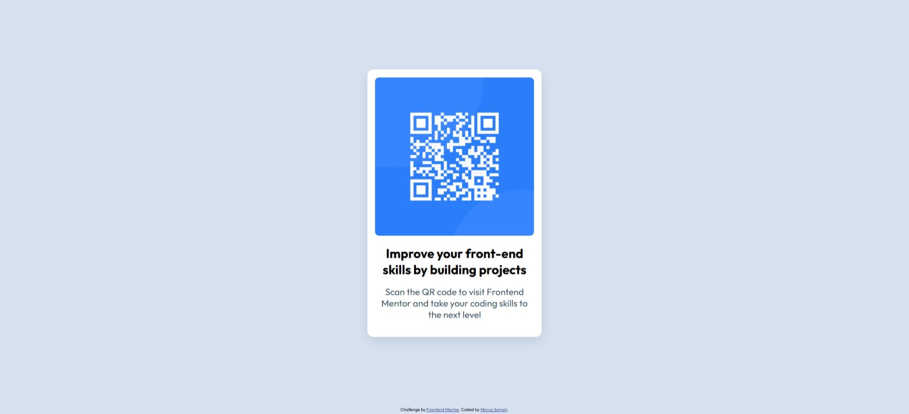

# Frontend Mentor - QR code component solution

This is a solution to the [QR code component challenge on Frontend Mentor](https://www.frontendmentor.io/challenges/qr-code-component-iux_sIO_H). Frontend Mentor challenges help you improve your coding skills by building realistic projects.

## Table of contents

- [Overview](#overview)
    - [Screenshot](#screenshot)
    - [Links](#links)
- [My process](#my-process)
    - [Built with](#built-with)
    - [What I learned](#what-i-learned)
    - [Continued development](#continued-development)
    - [Useful resources](#useful-resources)
    - [AI Collaboration](#ai-collaboration)
- [Author](#author)

## Overview

### Screenshot



### Links

- Solution URL: [Frontend Mentor](https://www.frontendmentor.io/solutions/html-and-css-solution-DD1cElnjHR)
- Live Site URL: [QR Code Component Live Site](https://qr-code-component6.netlify.app/)

## My process

### Built with

- Semantic HTML5 markup
- CSS custom properties
- Flexbox

### What I learned

I learnt how to write semantic HTML5 code that is easy to understand and maintain.
I also learnt how to use CSS custom properties to make the design more flexible and easier to change.
I also learnt how to use the CSS `min-content` property to make the QR code fit the container.

```html
<h1>Some HTML code I'm proud of</h1>

```
```css
.proud-of-this-css {
  width: min-content;
}
```

### Continued development

I plan to continue working on this project to improve my skills and learn more about CSS and add mobile responsiveness.

### Useful resources

- [Scrimba](https://scrimba.com/home) – This helped me to learn the fundamentals of HTML and CSS. I really liked
  this pattern and will use it going forward.

### AI Collaboration

- The AI tool I used was Gemini.
- I used it to ask if my project was ready for review.
- It gave me feedback on the quality of my code to refine the CSS design.

## Author

- Frontend Mentor - [@Marco64-bit](https://www.frontendmentor.io/profile/Marco64-bit)
- Twitter - [@MarcoSameh17](https://x.com/MarcoSameh17)

